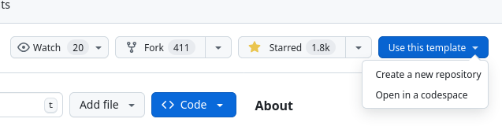
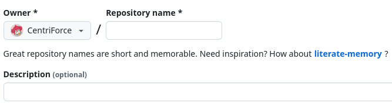

很久之前就收藏了[现在使用的博客模板](https://github.com/saicaca/fuwari)，但是因为一直想自己做一个博客模板而迟迟没有部署。现在变懒了，不想自己写前端做博客了，就拿自己喜欢的模板套一下搭个简单的博客吧。

## 1. 以博客模板仓库为模板，创建自己的新仓库

进入[博客模板](https://github.com/saicaca/fuwari)页面，可以看到右上角有一个 `Use this template` 按钮，点击后选中 `Create a new repository` 就可以基于此仓库创建你自己的新仓库（也可以右上角选择 `fork` ，效果一样）



进入新建仓库的页面后，需要输入自己仓库的名称。



:::note
注意，如果你既没有购买 `Github` 的高级订阅，也没有购买域名，没有域名解析服务，那么请将仓库名称设为 `YourGithubName.github.io`，其中 `YourGithubName` 是你的 `Github` 账户名。

也就是说，你新仓库的网址应该是 `https://github.com/YourGithubName/YourGithubName.github.io` 的格式。
:::

创建完成后，会自动转到新仓库页面


## 2. 将仓库内容克隆至本地

:::warning
如果完全不会或不了解，请务必参考 `Github` 仓库克隆教程！
:::

如果使用 `Windows` 或 `Mac OS`，可以下载 `Github Desktop` 进行仓库克隆，这种方法较为简单。通用的方法是下载安装 `Git`，配置本地 `Git` 账户，与 `Github` 账户相符。然后在终端输入命令，将仓库克隆至本地。

假设你的 `Github` 名称是 `YourGithubName`，你的 `Github` 电子邮箱是 `YourEmail@mail.com`，你的仓库位置是 `https://github.com/YouYourGithubNamerName/YourRepository.github.io.git`，那么你该输入的命令大概是：

```bash
git config --global user.name YourGithubName
git config --global user.email YourEmail@mail.com
git clone https://github.com/YourGithubName/YourRepository.github.io.git
```

克隆成功后，你会在当前目录中找到你的仓库文件夹。

## 3. 修改仓库配置文件

不同博客模板的配置文件有所不同，请参考博客模板中的 `README.md` 内容。

对于我使用的博客模板，想要在 `Github` 上部署，至少需要修改 `astro.config.mjs` 文件中的内容。在第 `24` 和 `25` 行，需要修改 `site` 和 `base` 的内容。

如果你购买了域名，将 `site` 中的内容替换为你的域名。如果你没有购买域名，将 `site` 中的内容替换为 `YourGithubName.github.io`，其中 `YourGithubName` 是你的 `Github` 账户的名字。

## 4. 添加 `Github Action`

在你的仓库根目录下创建 `.github` 文件夹，再在该文件夹中创建一个 `workflows` 文件夹，最后创建一个名为 `deploy.yml` 的文件，并在里面输入以下内容：

```yaml
name: Deploy to GitHub Pages

on:
  # Trigger the workflow every time you push to the `main` branch
  # Using a different branch name? Replace `main` with your branch’s name
  push:
    branches: [ main ]
  # Allows you to run this workflow manually from the Actions tab on GitHub.
  workflow_dispatch:

# Allow this job to clone the repo and create a page deployment
permissions:
  contents: read
  pages: write
  id-token: write

jobs:
  build:
    runs-on: ubuntu-latest
    steps:
      - name: Checkout your repository using git
        uses: actions/checkout@v4
      - name: Install, build, and upload your site
        uses: withastro/action@v3
        # with:
          # path: . # The root location of your Astro project inside the repository. (optional)
          # node-version: 20 # The specific version of Node that should be used to build your site. Defaults to 20. (optional)
          # package-manager: pnpm@latest # The Node package manager that should be used to install dependencies and build your site. Automatically detected based on your lockfile. (optional)

  deploy:
    needs: build
    runs-on: ubuntu-latest
    environment:
      name: github-pages
      url: ${{ steps.deployment.outputs.page_url }}
    steps:
      - name: Deploy to GitHub Pages
        id: deployment
        uses: actions/deploy-pages@v4
```

保存文件，你的文件路径应该位于 `/.github/workflows/deploy.yml`。

## 5. 修改仓库的页面设置，应用 `Github Action`

来到你的 `Github` 仓库的网页页面，点击 `Setting` 按钮，找到 `Pages` 设置。


找到 `Build and deployment` 的 `Source` 设置，将其修改为 `Github Action`。

最后，将本地仓库的修改内容保存并提交到 `Github`，`Github Action` 会自动运行配置命令，一段时间后你就可以访问自己的博客了！

## 备注

如果有什么不清楚的地方，请首先参考博客模板的 `README.md` 内容。同时参考以下文档内容：

[Deploy your Astro Site | 部署你的 Astro 站点](https://docs.astro.build/en/guides/deploy/)

[Getting started with Git | Git 入门](https://docs.github.com/en/get-started/getting-started-with-git)

如果想要在本地调试博客，也请参考博客模板的 `README.md` 内容。通常需要安装 `nodejs` 和 `pnpm`。